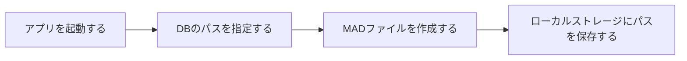
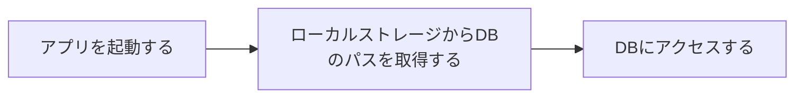

# TodoApp

前に作ったSortTodoをレポジトリにします

詳しい利用手順はForUser.mdを確認してください。

## 省略語

- Microsoft Access Database->MAD
- Database->DB
- OneDrive->OD
- ShellScriptファイル->SHファイル

## ローカルで動かす方法

### 必要な開発環境

- windows環境
- Python 3.8以上
- Flask
- その他、`requirements.txt`に記載されているライブラリ

### 手順

1. このレポジトリをクローンする

```bash
git clone https://github.com/Tealands/TodoApp
```

2. クローンしたディレクトリに移動する
3. 必要なライブラリをインストールして、アプリを起動する

```bash
pip install -r requirements.txt
python app.py
```

4. ブラウザで `http://localhost:5000` にアクセスする

## 今後の追加要素

- 万人が使えるように、データを保存するMADのパスを指定して、そこにMADファイルがなければ作成する。そして、そのパスはブラウザのローカルストレージに保存するようにする。このパスをODの中などにすることで複数の端末から同じDBにアクセスできる。

**初回アクセス時のフロー**

**2回目以降のアクセス時のフロー**


- デスクトップにアイコン付き実行ファイルを作成する

